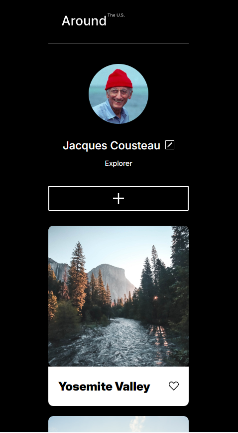
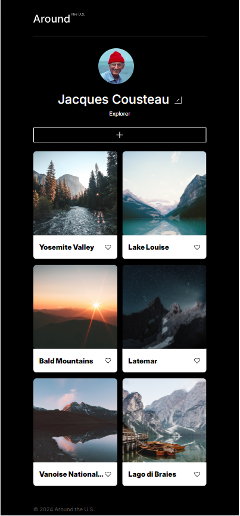
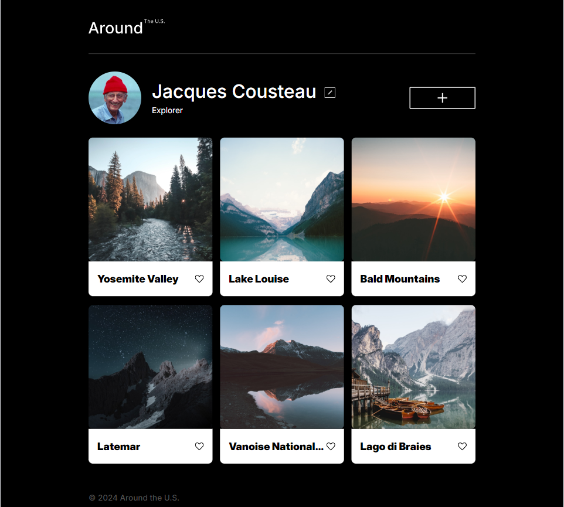

# Project 3: Around The U.S.

This project is made so all the elements adapt and look good on the popular screen sizes.
Some of the techniques used in this project were grid layout, flex box, bem method, all used to create an adaptive design making sure that the page appearance is maintained throughout screen sizes.

# Images

# Git hub pages link

[Link to my project](https://justin-youngs.github.io/se_project_aroundtheus)

# video

[Link to my video](https://www.loom.com/share/2a9ec3b95fec482694d99b3260dfd352?sid=80a6ab0b-b287-43db-9c23-7815ca67fcec)
